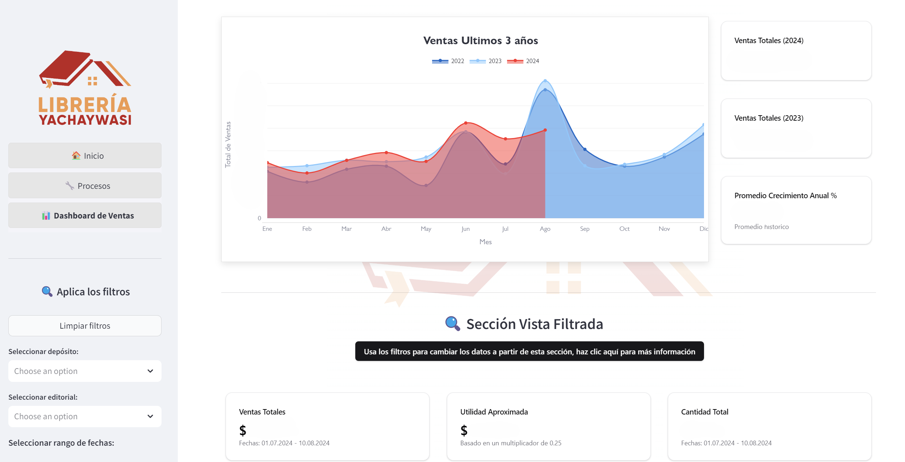

<!-- Animated Header -->

<p align="center">
  <!-- Typing SVG by DenverCoder1 - https://github.com/DenverCoder1/readme-typing-svg -->
  <a href="https://github.com/NicolasMarca/NicolasMarca">
      
  </a>
</p>

<p align="center">
  <a href="https://github.com/NicolasMarca/NicolasMarca">
      
  </a>
</p>

<!-- Icons section -->


<p align="center">
  <a href="mailto:nmarqueznarvaez@gmail.com"></a>
  &#8287;&#8287;&#8287;&#8287;&#8287;
  <a href="https://www.linkedin.com/in/nicolasmarqueznarvaez"></a>
</p>

<hr>

<h3 align="center"> 👨‍💻 About Me</h3>
<p align="center">
  <samp>
    I am an experienced Consultant and Data Analyst with a strong background in leveraging advanced statistics and data analytics to drive impactful outcomes. My career has spanned various sectors, including banking, international organizations, and the private sector. I have a deep passion for transforming raw data into actionable insights that can guide strategic decisions. Currently, I am working as a Data Analytics Consultant for the United Nations Migration (IOM), where I specialize in optimizing data processes, doing research and providing measurable outcomes that support global initiatives.
  </samp>
  <br> <br>
  
</p>

<hr>

<h3 align="center"> 📋 Detailed Overview</h3>


```python
profile = {
    "Name": "Nicolás Márquez",
    "Current Role": "Data Analytics Consultant",
    "Nationality": "Bolivian",
    "Languages": ["Spanish (Native)", "English (C1)", "German (B1)", "French (B1)"],
    "Technical Proficiencies": {
        "Programming & Scripting Languages": ["Python", "R", "SQL", "HTML", "CSS"],
        "Data Visualization Tools": ["Power BI", "Tableau"],
        "Database Management": ["MySQL", "SQL Server"],
        "Statistical & Analytical Software": ["STATA", "R"],
        "Automation & ETL Tools": ["Python", "Power Automate"]
    }
}
```

</p>

<hr>

<h3 align="center">📂 Some of my projects</h3>

<!-- Project 1 -->
<table>
  <tr>
    <td style="width: 40%; padding-right: 20px; vertical-align: top;">
      <h4><samp>Project 1: Process Automation and Data Analysis Application</samp></h4>
      <ul>
        <samp>
          <li><strong>Project Description:</strong> Developed an application to automate business processes, perform exploratory data analysis, and create a sales dashboard with forecasting capabilities. The dashboard allows the user to adjust forecasts based on different scenarios, web scrape for relevant data, and analyze and clean datasets.</li>
          <li><strong>Key libraries:</strong> Streamlit, Pandas, NumPy, BeautifulSoup, Scipy, Requests, Plotly.</li>
          <li><strong>Impact:</strong> The application significantly reduced the time required for data processing and reporting, enabling the business to make data-driven decisions more quickly.</li>
        </samp>
      </ul>
    </td>
    <td style="width: 60%;">
      
    </td>
  </tr>
</table>


<!-- Disclaimer -->
<p align="center">
  <samp>
  <em>Note: These projects are internal and confidential, so the source code cannot be shared publicly. However, I am open to discussing them in detail and am currently working on adapting some projects for public release.</em></samp>
</p>


