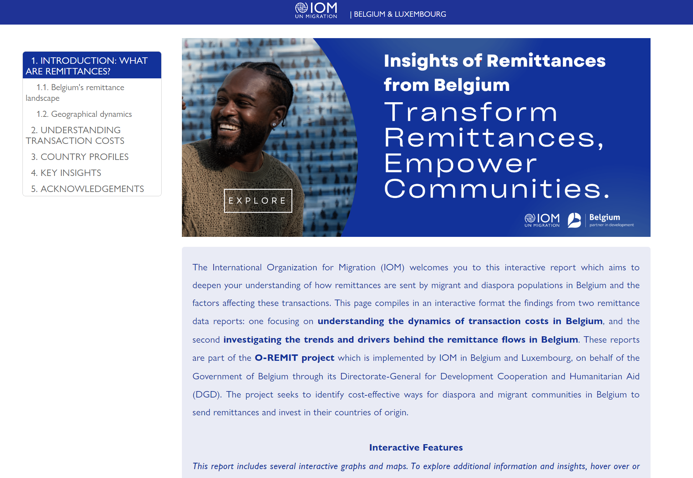
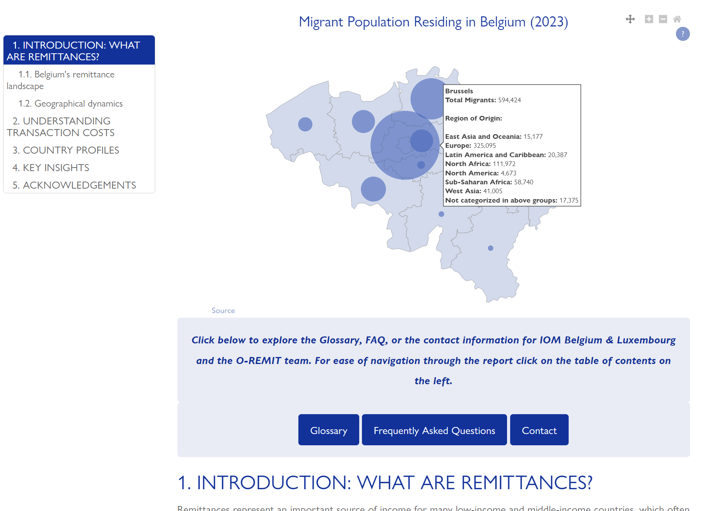
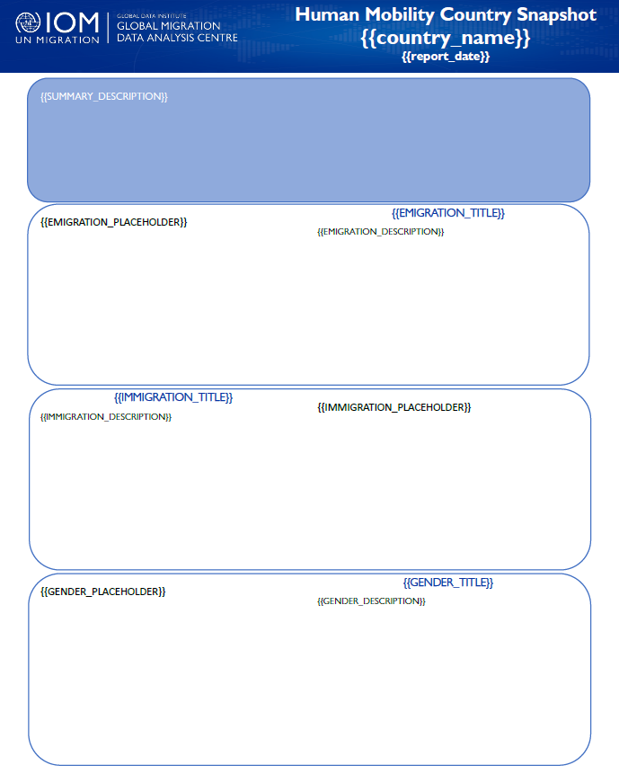
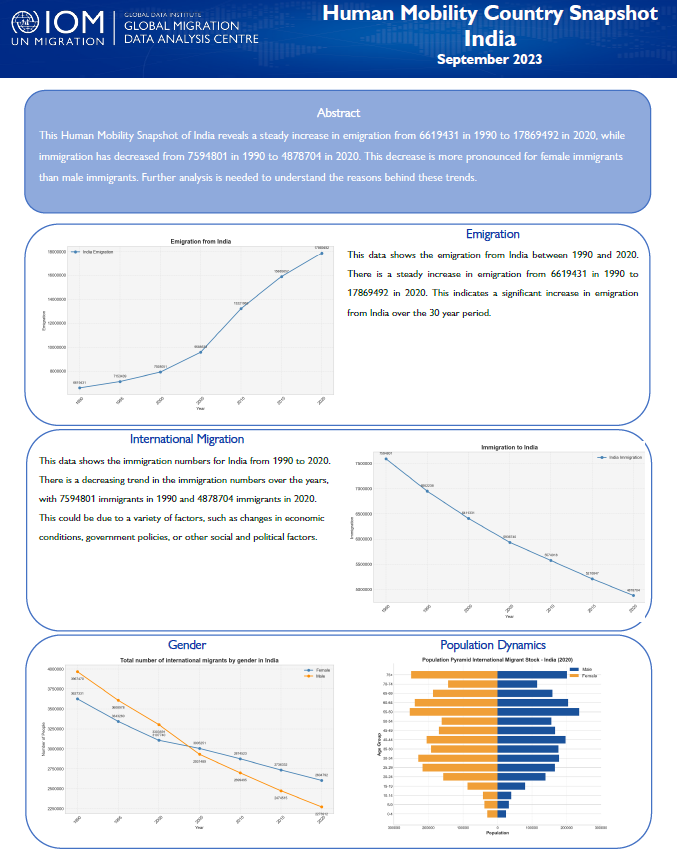

<!-- Animated Header -->

<p align="center">
  <!-- Typing SVG by DenverCoder1 - https://github.com/DenverCoder1/readme-typing-svg -->
  <a href="https://github.com/NicolasMarca/NicolasMarca">
      
  </a>
</p>

<p align="center">
  <a href="https://github.com/NicolasMarca/NicolasMarca">
      
  </a>
</p>

<!-- Icons section -->


<p align="center">
  <a href="mailto:nmarqueznarvaez@gmail.com"></a>
  &#8287;&#8287;&#8287;&#8287;&#8287;
  <a href="https://www.linkedin.com/in/nicolasmarqueznarvaez"></a>
</p>

<hr>

<!-- About me section -->

<h3 align="center"> 👨‍💻 About me</h3>
<p align="center">
  <samp>
    I am an experienced Consultant and Data Analyst with a strong background in leveraging advanced statistics and data analytics to drive impactful outcomes. My career has spanned various sectors, including banking, international organizations, and the private sector. I have a deep passion for transforming raw data into actionable insights that can guide strategic decisions. Currently, I am working as a Data Analytics Consultant for the United Nations Migration (IOM), where I specialize in optimizing data processes, doing research and providing measurable outcomes that support global initiatives.
  </samp>
  <br> <br>
  
</p>

<hr>

<!-- Define myself section -->

<h3 align="center"> 📋 How I would define myself</h3>


```python
class Nicolas:

    def __init__(self):
        self.name = 'Nicolás Márquez'
        self.position = 'Data Analytics Consultant'
        self.nationality = 'Bolivian'
        self.skill_set = {
            'programming_scripting_languages': ['Python', 'R', 'SQL', 'HTML', 'CSS'],
            'data_visualization': ['Power BI', 'Tableau', 'Plotly', 'Seaborn', 'Matplotlib', 'Streamlit'],
            'database_management': ['MySQL', 'SQL Server'],
            'statistical_analysis': ['Python', 'STATA', 'R', 'Scipy', 'Statsmodels'],
            'machine_learning': ['Sklearn', 'Tensorflow'],
            'automation_etl': ['Python', 'Power Automate'],
            'data_manipulation': ['Numpy', 'Pandas']
        }
        
    def __str__(self):
        return f'{self.name} | {self.position}'


if __name__ == '__main__':
    me = Nicolas()
    print(me)
```

</p>

<hr>

<!-- Project section -->

<h3 align="center">📂 Some of my projects</h3>


<!-- Project 1 -->
<table>
  <tr>
    <td width="45%" style="padding-right: 20px;">
      <h4><samp>Project 1: Process Automation and Data Analysis Application</samp></h4>
      <ul>
        <samp>
          <li><strong>Project Description:</strong> Developed an application to automate business processes, perform exploratory data analysis, and create a sales dashboard with forecasting capabilities. The dashboard allows the user to adjust forecasts based on different scenarios, web scrape for relevant data, and analyze and clean datasets.</li>
          <li><strong>Key libraries:</strong> Streamlit, Pandas, NumPy, BeautifulSoup, Scipy, Requests, Plotly.</li>
          <li><strong>Impact:</strong> The application significantly reduced the time required for data processing and reporting, enabling the firm to make data-driven decisions more quickly.</li>
        </samp>
      </ul>
    </td>
    <td width="55%">
      
    </td>
  </tr>
</table>

<!-- Project 2 -->
<table>
  <tr>
    <td width="45%" style="padding-right: 20px;">
      <h4><samp>Project 2: Interactive Market Analysis Report (Expected Release September 2024)</samp></h4>
      <ul>
        <samp>
          <li><strong>Project Description:</strong> Developed an interactive report to draw insights from a market analysis of remittances in Belgium, designed to be embedded and displayed on a website. The report allows users to explore data interactively, displaying graphs and visualizations that make the insights clear and accessible. The analysis is based on <a href="https://belgium.iom.int/remittances-belgium-key-data"> two previous studies</a>  were I employed advanced statistical techniques to analyze the cause-and-effect relationships within the remittance market in Belgium. For this purpose, I constructed a comprehensive database and established an ETL process to manage and integrate the data effectively.</li>
          <li><strong>Key Technologies Used:</strong> Pandas, NumPy, Seaborn, Plotly (express, graph_objects, subplots), Bar Chart Race, GeoPandas, Pretty Jupyter, Jinja, HTML, CSS.</li>
          <li><strong>Expected Outcome:</strong> To provide stakeholders with a clearer understanding of the remittance market dynamics in Belgium. By enabling the exploration of data in an interactive format, its aim is to enhance the decision-making processes and allow for more targeted interventions in the market.</li>
        </samp>
      </ul>
    </td>
    <td width="55%">
      
            
    </td>
  </tr>
</table>


<!-- Project 3 -->
<table>
  <tr>
    <td width="45%" style="padding-right: 20px;">
      <h4><samp>Project 3: Automated Report Generation System</samp></h4>
      <ul>
        <samp>
          <li><strong>Project Description:</strong> Developed an automated report generation system to establish a consistent and efficient framework for generating analytical reports based on selected indicators and IDs. The system utilizes a standardized template to quickly generate reports that include KPIs, trend analysis, and key statistics.</li>
          <li><strong>Key Technologies Used:</strong> SQL, Python, Pandas, Matplotlib, Seaborn, NumPy, Docxtpl (for report templating), Jinja (for templating), OpenAI API.</li>
          <li><strong>Impact:</strong> The automated report generation system aim was to improve the efficiency of generating actionable insights and to facilitate more timely analysis and decision-making.
</li>
        </samp>
      </ul>
    </td>
    <td align="center" width="27.5%">
      <samp><strong>Report Jinja2 Template (Pg 1)</strong></samp>
            
    </td>
        <td align="center" width="27.5%">
      <samp><strong>Example India (Pg 1)</strong></samp>
            
    </td>
  </tr>
</table>

<!-- Disclaimer -->
<p align="center">
  <samp>
  <em>Note: As these are internal projects the source code cannot be shared publicly, however, I am quite open to discussing about them. I am currently working on adapting some projects for public release.</em></samp>
</p>


<hr>
<!-- End section -->

<h4 align="center">🤝 Connect with me</h4>


<p align="center">
  <samp>
  <em>I'm always interested in collaborating on innovative projects or discussing data-driven solutions. Feel free to connect with me on <a href="https://www.linkedin.com/in/nicolasmarqueznarvaez">Linkedin</a> or reach out via <a href="mailto:nmarqueznarvaez@gmail.com">email</a>.
</samp>
</p>
<hr>


